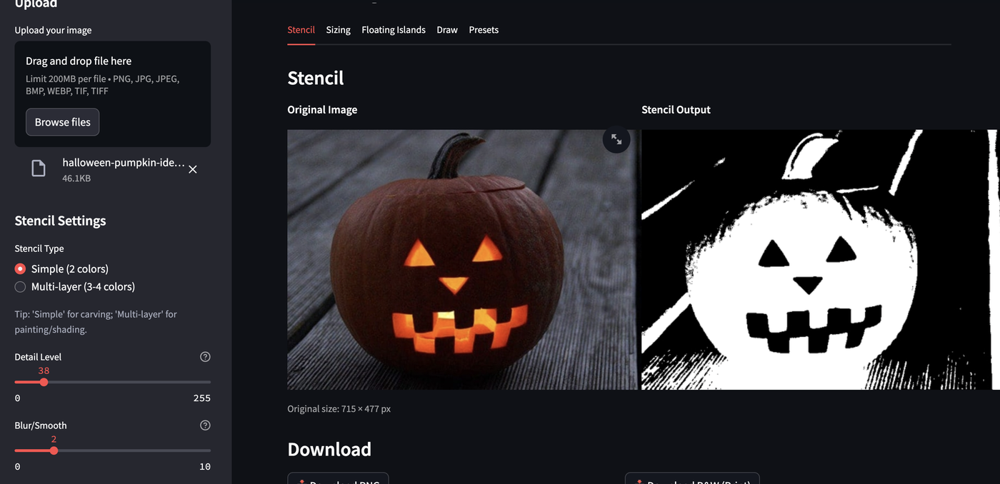
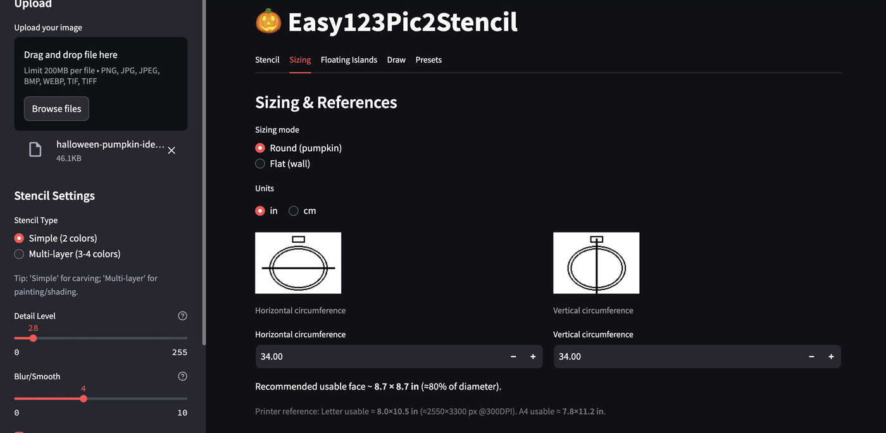

# 🎃 Easy123Pic2Stencil
by **aiwebautomation**

[](https://easy123pic2stencil.streamlit.app)  
*Turn any image into a printable pumpkin stencil — click to launch instantly.*

---


**Easy123Pic2Stencil** converts any photo, logo, or sketch into a clean black‑and‑white stencil ready for carving, wall art, or vinyl cutting.  
Upload → Size → Preview → Print. That’s it.

---

### 🪄 Highlights
- **Auto sizing** from pumpkin circumference or flat wall dimensions  
- **Block Mode** for beginners — single connected shapes, no floating cutouts  
- **Greyscale + stencil previews** side by side  
- **Reverse toggle** (flip carved vs. surface regions)  
- **Instant 100%‑scale PDF export** for printer‑ready output  
- Runs entirely offline once installed

---

### 🖼 Interface Preview
| Stencil Generation | Sizing Tab | Draw / Touchup |
|:--:|:--:|:--:|
|  |  |  |

---

### 🚀 Quick Start

**Run online:**  
👉 [https://easy123pic2stencil.streamlit.app](https://easy123pic2stencil.streamlit.app)

**Run locally:**
```bash
git clone https://github.com/aiwebautomation/Easy123Pic2Stencil
cd Easy123Pic2Stencil
python3 -m venv .venv && source .venv/bin/activate
pip install -r requirements.txt
python -m streamlit run easy123_pic2stencil.py
```

---

### 🧾 Print Reference
| Paper | Usable Area | Notes |
|-------|--------------|-------|
| Letter (8.5×11 in) | ~8.0×10.5 in | ≈2550×3300 px @ 300 DPI |
| A4 (210×297 mm) | ~7.8×11.2 in | ≈2480×3508 px @ 300 DPI |

🖨️ *Always print at 100% — no “fit to page.”*

---

### ⚙️ Credits
Built with ❤️ by [aiwebautomation](https://github.com/aiwebautomation)  
Powered by **Streamlit**, **Pillow**, **NumPy**, and **SciPy**  
MIT License © 2025
